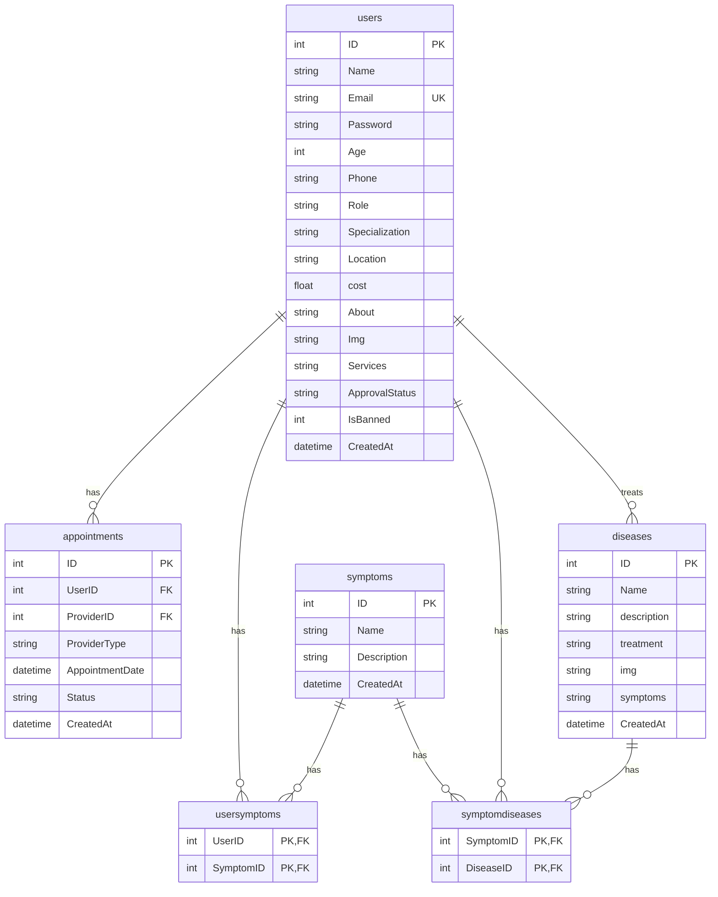

# MedMind — Database Diagrams

## Entity-Relationship Diagram (Mermaid)



## Table Diagrams

### `users` Table

```
┌─────────────────────────────────────────────────────────────────────┐
│                            users                                     │
├──────────────┬──────────────────┬──────────┬───────────────────────┤
│ Column       │ Type             │ Nullable │ Notes                 │
├──────────────┼──────────────────┼──────────┼───────────────────────┤
│ ID           │ INTEGER PK AI    │ NO       │ Primary Key           │
│ Name         │ VARCHAR(100)     │ NO       │                       │
│ Email        │ VARCHAR(100) UK  │ NO       │ Unique                │
│ Password     │ VARCHAR(255)     │ NO       │ Plaintext (security   │
│              │                  │          │ issue - see BUGS.md)  │
│ Age          │ INTEGER          │ YES      │                       │
│ Phone        │ VARCHAR(20)      │ YES      │                       │
│ Role         │ VARCHAR(20)      │ NO       │ Patient/Doctor/Hospital/│
│              │                  │          │ Admin                 │
│ Specialization│ VARCHAR(100)    │ YES      │ Doctor only           │
│ Location     │ TEXT             │ YES      │ Doctor/Hospital       │
│ cost         │ NUMERIC(10,2)    │ YES      │ Doctor only           │
│ About        │ TEXT             │ YES      │ Doctor only           │
│ Img          │ TEXT             │ YES      │                       │
│ Services     │ TEXT             │ YES      │ Hospital only         │
│ ApprovalStatus│ VARCHAR(20)     │ NO       │ Pending/Approved/     │
│              │                  │          │ Rejected              │
│ IsBanned     │ INTEGER          │ NO       │ 0/1                   │
│ CreatedAt    │ DATETIME         │ NO       │ DEFAULT CURRENT_TIMESTAMP│
└──────────────┴──────────────────┴──────────┴───────────────────────┘
```

### `appointments` Table

```
┌─────────────────────────────────────────────────────────────────────┐
│                         appointments                                │
├──────────────┬──────────────────┬──────────┬───────────────────────┤
│ Column       │ Type             │ Nullable │ Notes                 │
├──────────────┼──────────────────┼──────────┼───────────────────────┤
│ ID           │ INTEGER PK AI    │ NO       │ Primary Key           │
│ UserID       │ INTEGER FK       │ NO       │ → users(ID)           │
│ ProviderID   │ INTEGER FK       │ YES      │ → users(ID)           │
│              │                  │          │ NULL = no appointment │
│ ProviderType │ VARCHAR(10)      │ YES      │ 'Doctor' or           │
│              │                  │          │ 'Hospital'            │
│ AppointmentDate│ DATETIME       │ NO       │                       │
│ Status       │ VARCHAR(20)      │ NO       │ Pending/Confirmed/    │
│              │                  │          │ Cancelled             │
│ CreatedAt    │ DATETIME         │ NO       │ DEFAULT CURRENT_TIMESTAMP│
└──────────────┴──────────────────┴──────────┴───────────────────────┘
```

### `symptoms` Table

```
┌─────────────────────────────────────────────────────────────────────┐
│                          symptoms                                    │
├──────────────┬──────────────────┬──────────┬───────────────────────┤
│ Column       │ Type             │ Nullable │ Notes                 │
├──────────────┼──────────────────┼──────────┼───────────────────────┤
│ ID           │ INTEGER PK AI    │ NO       │ Primary Key           │
│ Name         │ VARCHAR(70)      │ NO       │                       │
│ Description  │ TEXT             │ YES      │                       │
│ CreatedAt    │ DATETIME         │ NO       │ DEFAULT CURRENT_TIMESTAMP│
└──────────────┴──────────────────┴──────────┴───────────────────────┘
```

### `diseases` Table

```
┌─────────────────────────────────────────────────────────────────────┐
│                          diseases                                    │
├──────────────┬──────────────────┬──────────┬───────────────────────┤
│ Column       │ Type             │ Nullable │ Notes                 │
├──────────────┼──────────────────┼──────────┼───────────────────────┤
│ ID           │ INTEGER PK AI    │ NO       │ Primary Key           │
│ Name         │ VARCHAR(70)      │ NO       │                       │
│ description  │ TEXT             │ YES      │                       │
│ treatment    │ TEXT             │ YES      │                       │
│ img          │ TEXT             │ YES      │                       │
│ symptoms     │ TEXT             │ YES      │ Comma-separated       │
│              │                  │          │ symptom names         │
│ CreatedAt    │ DATETIME         │ NO       │ DEFAULT CURRENT_TIMESTAMP│
└──────────────┴──────────────────┴──────────┴───────────────────────┘
```

### `usersymptoms` Junction Table

```
┌─────────────────────────────────────────────────────────────────────┐
│                       usersymptoms                                   │
├──────────────┬──────────────────┬──────────┬───────────────────────┤
│ Column       │ Type             │ Nullable │ Notes                 │
├──────────────┼──────────────────┼──────────┼───────────────────────┤
│ UserID       │ INTEGER PK,FK    │ NO       │ → users(ID)           │
│ SymptomID    │ INTEGER PK,FK    │ NO       │ → symptoms(ID)        │
└──────────────┴──────────────────┴──────────┴───────────────────────┘
```

### `symptomdiseases` Junction Table

```
┌─────────────────────────────────────────────────────────────────────┐
│                     symptomdiseases                                  │
├──────────────┬──────────────────┬──────────┬───────────────────────┤
│ Column       │ Type             │ Nullable │ Notes                 │
├──────────────┼──────────────────┼──────────┼───────────────────────┤
│ SymptomID    │ INTEGER PK,FK    │ NO       │ → symptoms(ID)        │
│ DiseaseID    │ INTEGER PK,FK    │ NO       │ → diseases(ID)        │
└──────────────┴──────────────────┴──────────┴───────────────────────┘
```

## Relationship Summary

| Relationship | Type | Tables | Notes |
|---|---|---|---|
| User → Appointments | One-to-Many | users → appointments | One user has many appointments |
| User → Provider (Doctor/Hospital) | One-to-Many | users → appointments | One provider has many appointments |
| User → Symptoms | One-to-Many | users → usersymptoms | One user can have many symptoms |
| Symptom → Diseases | Many-to-Many | symptoms ↔ diseases | Via symptomdiseases junction |
| Symptom → Users | Many-to-Many | symptoms ↔ users | Via usersymptoms junction |
| Provider → Appointments | One-to-Many | users → appointments | Provider can have many appointments |

## Indexes

| Index | Table | Column(s) | Purpose |
|---|---|---|---|
| idx_users_email | users | Email | Fast user lookup by email |
| idx_appointments_user | appointments | UserID | Fast appointment lookup by user |
| idx_appointments_provider | appointments | ProviderID | Fast appointment lookup by provider |
| idx_appointments_type | appointments | ProviderType | Filter by provider type |
| idx_symptoms_name | symptoms | Name | Fast symptom lookup by name |
| idx_diseases_name | diseases | Name | Fast disease lookup by name |
| idx_symptomdiseases_symptom | symptomdiseases | SymptomID | Fast symptom-disease linking |
| idx_symptomdiseases_disease | symptomdiseases | DiseaseID | Fast disease-symptom linking |
